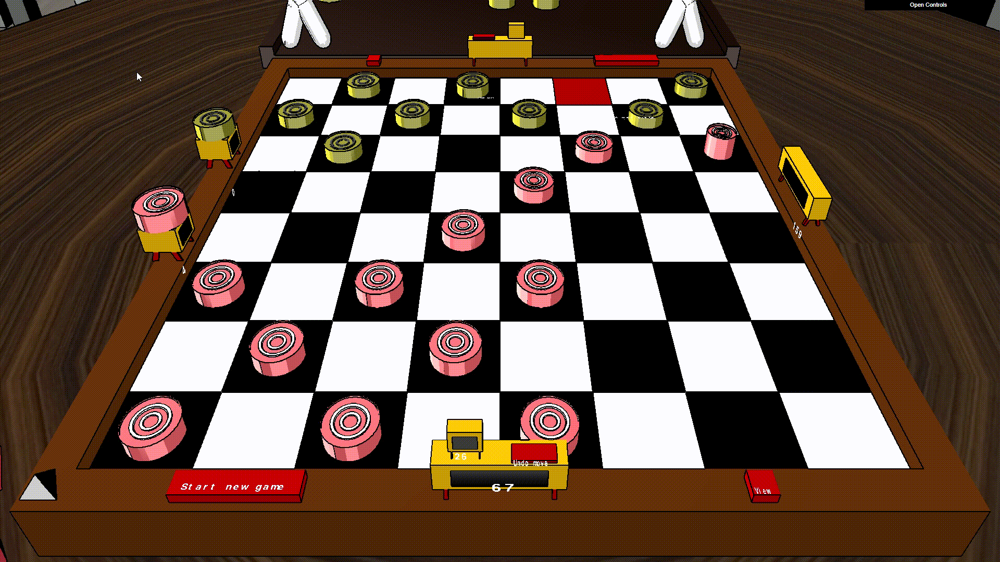
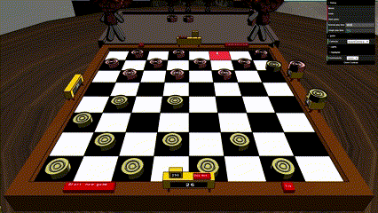
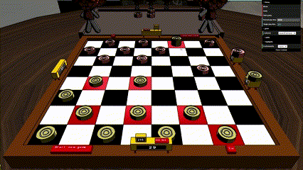

# SGI 2022/2023

## Group T05G02
| Name             | Number    | E-Mail                   |
| ---------------- | --------- | ------------------------ |
| Bruno Gomes      | 201906401 | up201906401@edu.fe.up.pt |
| José Costa       | 201907216 | up201907216@edu.fe.up.pt |

----
# Introduction

This is a project developed in first year's of FEUP, Master in Informatics and Computing Engineering, Interactive Graphics Systems.
It is composed of 3 parts, TP1, TP2, TP3.
The project is a graphics engine, with animations, materials, textures, shaders, lightning, and in TP3, a checkers game was developed with the graphics engine. 
All the parts are developed with CGF, which is a framework built on top of WebGL, and makes it easier to develop. However in order to make the toon shader, it was necessary to use pure WebGL for multiple render passes.
The scene graph is described in a .xml file, and a parser was made in order to read from it.

## Projects

### [TP1 - Scene Graph](./tp1)
#### 
  - Parser
    - Materials and Textures
    - Lights, Focal
    - Cameras
    - Extensive error checking and forgiving defaults, displaying console warnings
    - Debug folder in interface with lights position visibility, axis visibility and objects' normals
    - Refactored codebase
    - Default missing texture

  - Scene - Computer Room

    Living room with a computer desk with a coffee mug on top and someone famous using the computer to enjoy the 80's top hit 'Never Gonna Give You Up'.There's a small gift stuffed under the table. Next to the table there's a sofa with two famous characters holding hands and throwing paper planes. There are paintings on the walls, and a small lamp. There are plants scattered around the room. In the center, we can find a table full of empty coffee mugs and two chairs.
  
You can find the scene graph files in [the project subfolder](./tp1/scenes/)

Or run it online at: [https://brunogomes30.github.io/checkers-game/tp1/](https://brunogomes30.github.io/checkers-game/tp1/)

### [TP2 - Improving WebGl technique](./tp2)
  - Added keyframe animations (Translation, Scaling and rotation)
  - A highlight shader

  Living room with a computer desk with a coffee mug on top, that, as Schrödinger's cat, might me empty or full. Someone famous using the computer to be hipnotized by the 80's top hit 'Never Gonna Give You Up'.There's a small gift stuffed under the table under a camouflage tent. Next to the table there's a sofa with two famous characters holding hands and throwing paper planes. Theey are moving around the room into various positions There are paintings on the walls, and a small lamp, as well as a decorative barrel in the corner. There are plants scattered around the room that appear to have some sort of growth genetic mutation. In the center, we can find a table full of empty coffee mugs and two chairs.

You can find the scene files at: [the scenes subfolder](./tp2/scenes/)

Or run it online at: [https://brunogomes30.github.io/checkers-game/tp2/](https://brunogomes30.github.io/checkers-game/tp2/)

### [TP3 - Checkers game with Toon Shader](./tp3)
  - Include feature to xml files, so they become easier to manage 
  - Toon shader. [More info on it here](./docs/toonshader.md)
  - Extra parameters to animations so they aren't always linear
  - Classes to objects in scene, so they can be replicated/found easily for the game
  - Checkers game
  - Clickable buttons
  - .obj and .mtl files parser

We tried to seperate the game from the graphics engine as much as possible, however due to time constraints, and the lack of evaluation in it, some of it had to get mixed up a bit.

The game can be played against another player locally, by pressing the Start game Button. It's possible to undo moves by pressing the undo button.

Run it online at: [https://brunogomes30.github.io/checkers-game/tp3/](https://brunogomes30.github.io/checkers-game/tp3/)

