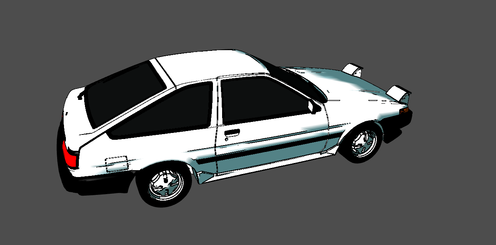

# Toon shader

Toon shading or cel shading is a non-realistic rendering designed to make 3d objects have a flat color, or tints and shades. It mimics the shading of cartoons.

There are many games that has this kind of shading, from old games like cel damage from 2002, to new games like hi-fi rush from 2023.

Cel Damage was the main inspiration for the art-style for this checkers game as it can be noticied by the animations and shading.

<div style="width:100%; justify-content:center; align-items:center;">
    <image src="../screenshots/toonshade/cel_damage.png" width="100%"/>
    <image src="../screenshots/toonshade/hi-fi-rush.jpg" width="100%"/>
</div>

This toon shader was implemented in a WebGL Engine in the context of a University Project, where we had to use **CGF**(A framework developed on top of WebGL, developed by our University, University of Porto). It is nowhere near perfect, it can be improved in alot of ways. However it did produce a good result, especially for the time constraint we had to develop, and that it added no value to our grade in the university.

Even though this was developed in **CGF**, this project should help anyone trying to build a toon shader for WebGL, and give clues on how to implement it in any other Graphics API.

## What was implemented in this shader
There are many features available from a toon shader, however the ones that were implemented here are:
- Stylized Specular Highlights
- Stylized Diffuse Illumination
- Outlines

### Stylized Specular Highlights and Stylized Diffuse Illumination
This both features can be explained in one. Normally in toon shading there is no inbetween for lit and unlit areas. Either it's lit or unlit. The same can be applied to the specular. In this project, Gouraud  was the illimunation model implemented, however the same concept could be applied to other illumination models.

<div style="width:100%; justify-content:center; align-items:center;">
    <image src="../screenshots/toonshade/sphere_illumination.png" width="50%" style="margin-left:25%"/>
</div>

```

// Diffuse calculation for a single light
float diffuseThreshold = 0.9;            
if(att * lambertTerm > diffuseThreshold){
    Id = uLight[i].diffuse * uFrontMaterial.diffuse * 1.0;
} else {
    Id = uLight[i].diffuse * uFrontMaterial.diffuse * 
    smoothstep(0.49, 0.5, att * lambertTerm);
} 


// Specular calculation for a single light
if(lambertTerm > 0.0) {
    float specular = 0.0;
    vec3 R = reflect(-L, N);
    if(dot(N, L) > 0.0){
            specular = smoothstep(0.9, 1.0, att * pow(max(dot(R, E), 0.0), uFrontMaterial.shininess));
    }
    Is = uLight[i].specular * uFrontMaterial.specular * specular;
}
// The Id(Illumination Diffuse) and Is(Illumination Specular) were added from all lights to determine the final color.

// A small smoothstep is implemented in order to smooth the edges, and avoid weird results. This happens mainly for being calculated in each vertice, and not in each pixel, like in the Phong Model.
```
Code from [../tp3/shaders/toon.glsl]()

Another way to implement this, would be to do the flatten the color after the calculation from all the lights, which would remove this weird results:
<div style="width:100%; justify-content:center; align-items:center;">
    <image src="../screenshots/toonshade/weird_corner.png" width="75%" style="margin-left:12.5%"/>
</div>

Which could turn out to be something like this
<div style="width:100%; justify-content:center; align-items:center;">
    <image src="../screenshots/toonshade/not_so_weird.png" width="75%" style="margin-left:12.5%"/>
</div>

### Outlines with edge detection

The main feature that I wanted to implement was the black outline. There are simple ways to detect the edges, however most of them didn't detect all edges.
The method I use for outlines, uses the Sobel operator to detect them.

It sums up the neighbour pixels multiplied by a coeficient, and the higher the sum, the most likely it is an edge. The current pixel is represented by the middle element in the matrix.
<div style="width:100%; justify-content:center; align-items:center;">
    <image src="../screenshots/toonshade/sobel.svg" width="50%" style="margin-left:25%; background:white; padding:5px"/>
</div>

However, before applying it to the shader, we need to know what the neighbour pixels are. The only way to properly do it is with render passes. In our project we had 3 render passes. One was the normals pass, which saveded the normals in .rgb and depth in .a. Another one was the color pass, which calculated the color and saved it in .rgba. And the last one, used the previous passes to add a black outline if it was the case, otherwhise, it would keep the color from the color pass.

The passes are represented here:
<div style="width:100%; justify-content:center; align-items:center;">
    <image src="../screenshots/toonshade/depth_pass.png" width="75%" style="margin-left:12.5%; background:white; padding:5px"/>
    <image src="../screenshots/toonshade/color_pass.png" width="75%" style="margin-left:12.5%; background:white; padding:5px"/>
    <image src="../screenshots/toonshade/outline_pass.png" width="75%" style="margin-left:12.5%; background:white; padding:5px"/>
</div>

By taking the color, normals and depth of the neighbour pixels, it's possible to detected most of the edges, even in textures. The sensitivity can be adjusted in the shader to each component individually.

#### How the render passes were developed

This was the moment where it got tricky, the framework ***CGF*** didn't support render passes, so we had to use pure WebGL. It took a couple of iterations to come to our current solution, which seems like a good scalable solution, if we wanted to add more render passes.

The shader files are:
- Depth pass: [depthVert.glsl](../tp3/shaders/depthVert.glsl) [depthFrag.glsl](../tp3/shaders/depthFrag.glsl)
- Color pass: [toon.glsl](../tp3/shaders/toon.glsl) [toonFrag.glsl](../tp3/shaders/toonFrag.glsl)
- Outline pass: [outlinevert.glsl](../tp3/shaders/outlineVert.glsl) [outlineFrag.glsl](../tp3/shaders/outlineFrag.glsl)

The 2 JS classes handling the shader passes are:  [shaderPass.js](../tp3/src/toonShade/shaderPass.js) and [toonShader.js](../tp3/src/toonShade/toonShader.js).

In the ToonShader class, we initialize all the shaders and passes.

For each ShaderPass, 

- The boolean *renderToTexture* in the constructor defines whether it renders to the screen, or a texture. 
- The JsObject *passDependencies* specifies the textures from previous passes that will be used in the shader.
```
 const depthShader = new CGFshader(gl, "shaders/depthVert.glsl", "shaders/depthFrag.glsl");
const toonShader = new CGFshader(gl, "shaders/toon.glsl", "shaders/toonFrag.glsl");
const outlineShader = new CGFshader(gl, "shaders/outlineVert.glsl", "shaders/outlineFrag.glsl");

const depthPass = new ShaderPass(scene, depthShader, true, [], depthAttributes);
const toonShadePass = new ShaderPass(scene, toonShader, true, [], toonAttributes);

//Outline pass is dependent of depthPass and toonShadePass generated textures
const outlinePass = new ShaderPass(scene, outlineShader, false, 
    [
        {
            'pass': depthPass,
            'bind': 1,
            'textureName': 'depthTexture'
        },
        {
            'pass': toonShadePass,
            'bind': 2,
            'textureName': 'colorTexture'
        }
    ]
, outlineAttributes);

this.shaderPasses = [
    depthPass,
    toonShadePass,
    outlinePass
];
```
The attributes are not so important to understand what's happening, but they are simple enough that can be checkout in the file. As we can see, the depthPass and toonShadePass(Color pass) render to a texture, and the outline pass renders to the screen. The rendered texture is saved inside the *ShaderPass.targetTexture* of each pass.

And to render, we just iterate through the passes
```
render(list) {
    for (const pass of this.shaderPasses) {
        pass.render(list);
    }
}
```

The ShaderPass has a initilization, where it initializes the texture it is going to render(if it renders to a texture). In the render function, it's worth noting where we set the textures rendered to the shader. 

```
  for (const dependency of this.passDependencies) {
        shaderValues[dependency.textureName] = {
            type: 'webglTexture',
            bind: dependency.bind,
            value: dependency.pass.targetTexture,
        };
    }

    if(this.targetTexture){
        gl.clear(gl.COLOR_BUFFER_BIT | gl.DEPTH_BUFFER_BIT);
        gl.enable(gl.DEPTH_TEST);
    }
    
    //Set default 
    scene.setActiveShader(this.shader, shaderValues, undefined, false);
```
*scene.setActiveShader* can be seen in [XMLScene.js](../tp3/XMLScene.js)

## Conclusion
This shader lacks alot of features/polish when compared to released games, it's worth to point out that this was a university project and we had time constraints and another projects to develop in the semester.

The code is not the cleanest, for sure there are optimizations that can be done. However it can be a starting point, or help anyone that wants to do something similar.
However, it still produced a decent result, and is something we are proud of. [Déjà vu. I've just been in this place before](https://brunogomes30.github.io/checkers-game/tp3/?file=trueno.xml&game=false)




## References

There were many videos or websites which I used to get ideas for this shader. 
Here are some of them. Learning from them could give you more ideas on how to improve, or simply understand how/why it works.
- [https://en.wikibooks.org/wiki/GLSL_Programming/Unity/Toon_Shading]()
- [https://www.youtube.com/watch?v=GGTTHOpUQDE]() - How we built the toon shading | Open Projects Devlog - Unity
- [https://www.youtube.com/watch?v=9fa4uFm1eCE&t=1059s]()Unlocking The Power Of Unity's Scriptable Render Pipeline - Unity Specific, however it talks about more features that a toon shader can have, for example the bloom effect in Hi-Fi Rush.
- [https://ameye.dev/notes/rendering-outlines/]() -  5 ways to draw an outline. The one implemented in this project was the Edge Detection.


